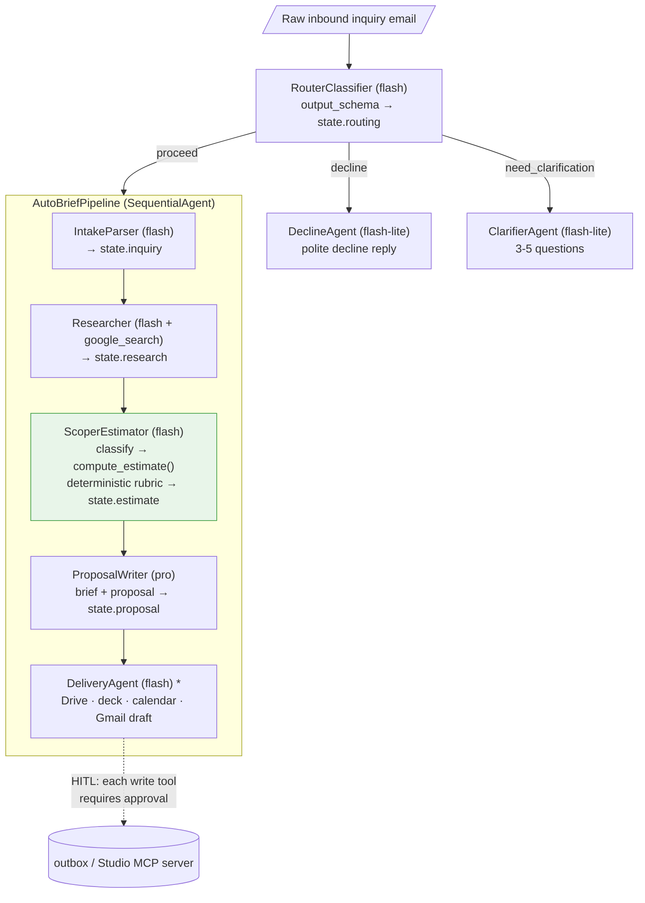

# AutoBrief

**Autonomous client-intake & proposal agent for a solo AI MVP studio.**
Built for the Google for Startups AI Agents Challenge (Track 1) on **Google ADK + Vertex AI**.

**Live demo (Cloud Run):** https://autobrief-g36me2m3ca-uc.a.run.app/dev-ui/?app=autobrief

A raw inbound client email goes in. AutoBrief triages it, researches the client,
classifies the project against a fixed rubric, computes a **deterministic** price
and timeline, writes a client-ready brief + proposal, and — once a human approves —
drafts the reply email, a kickoff calendar invite, a Drive doc, and a proposal deck.
Nothing client-facing is ever sent automatically; every irreversible action waits
behind a human-in-the-loop (HITL) approval gate.

---

## Why this exists

LightOn Plus Lab is a one-person studio in Anyang that ships focused web/mobile
MVPs in 2–6 weeks. The revenue bottleneck for a solo founder is *winning the work*:
every inbound inquiry costs **~3–5 hours** of reading, researching, scoping,
pricing, and writing a proposal — before a single line of code. AutoBrief collapses
that to **a few minutes of compute + a quick human review**, so the founder spends
time building instead of triaging.

## Architecture



`*` DeliveryAgent is wired only when `AUTOBRIEF_ENABLE_MCP=1` (interactive/deploy).
Plain-text version of the same flow:

```
                         user: raw inbound inquiry email
                                       │
                                       ▼
                          ┌──────────────────────────┐
                          │   AutoBriefRouter (root)  │  gemini-2.5-flash
                          │   triage: proceed /       │
                          │   clarify / decline       │
                          └─────┬───────────┬─────────┘
              proceed │         │ clarify   │ decline
                      ▼         ▼           └──────────► polite decline reply
   ┌───────────────────────────────────┐   ┌────────────────────┐
   │      AutoBriefPipeline             │   │  ClarifierAgent     │ flash-lite
   │      (SequentialAgent)             │   │  draft 3-5 Qs       │
   │                                    │   └────────────────────┘
   │  1. IntakeParser      flash  ──► state['inquiry']   (ClientInquiry)
   │  2. Researcher        flash  ──► state['research']  (google_search + citations)
   │  3. ScoperEstimator   flash  ──► state['estimate']  (LLM classifies, …
   │       └─ compute_estimate()  …  deterministic rubric does ALL the math)
   │  4. ProposalWriter    pro    ──► state['proposal']  (brief + proposal markdown)
   │  5. DeliveryAgent*    flash  ──► outbox/ via Studio MCP server (HITL-gated)
   └───────────────────────────────────┘
        * DeliveryAgent is wired only when AUTOBRIEF_ENABLE_MCP=1
          (interactive / deployed runs). Each write tool requires approval.
```

State flows between sub-agents the ADK-idiomatic way: each writes its result to
`session.state` via `output_key`, and the next agent references it in its
instruction template (`{inquiry}`, `{research}`, `{estimate}` …). No custom plumbing.

### Agents & model tiers

| Agent | ADK type | Model | Role |
|---|---|---|---|
| **AutoBriefRouter** (root) | `LlmAgent` (+ transfer) | flash | Triage proceed / clarify / decline |
| **IntakeParser** | `LlmAgent` (output_schema) | flash | Email → `ClientInquiry`, flags missing fields |
| **Researcher** | `LlmAgent` (`google_search`) | flash | Client/market research with citations |
| **ScoperEstimator** | `LlmAgent` + FunctionTool | flash | Classifies project; **deterministic tool prices it** |
| **ProposalWriter** | `LlmAgent` (output_schema) | pro | Brief + client-facing proposal prose |
| **ClarifierAgent** | `LlmAgent` | flash-lite | Drafts clarifying questions when too vague |
| **DeliveryAgent** | `LlmAgent` + MCP toolset | flash | Drive doc, deck, calendar, Gmail draft — all HITL-gated |

## Guardrails

1. **No auto-send.** The Gmail tool only ever creates a *draft*; every write action
   (Drive, deck, calendar, draft) is wrapped in an MCP `require_confirmation` HITL
   gate. Sending is structurally impossible without a human. _Verified end-to-end:_
   the read-only `suggest_kickoff_slot` runs un-gated, while all four write tools
   (`save_to_drive`, `generate_proposal_deck`, `create_calendar_event`,
   `create_gmail_draft`) each raise an `adk_request_confirmation` approval gate.
2. **No hallucinated prices.** The LLM only *classifies* (archetype, feature keys,
   complexity, rush). All pricing/timeline math lives in the deterministic
   `estimate_scope()` tool driven by `rubric.yaml`. Prices always trace to the rubric.
3. **Price-consistency check** — the proposal's quoted band must match the rubric
   output (`autobrief/tools/guardrails.py`).
4. **PII redaction** before any web research; emails/phones are stripped and never logged.
5. **Prompt-injection defense** — every inbound email is treated as untrusted *data*,
   never as instructions.

## Pricing rubric (deterministic)

`total = (base_days + add-ons) × complexity × rush × (1 + contingency)`, rounded to
a band; weeks clamped to the studio's 2–6 week model. Archetypes:
`landing+waitlist`, `crud-saas-mvp`, `ai-chat-assistant`, `data-dashboard`,
`mobile-companion`, `integration-glue`. See `autobrief/tools/rubric.yaml`.

**Quoting currency is selectable.** The rubric is the source of truth in KRW;
set `AUTOBRIEF_CURRENCY=USD` (or `KRW`, the default) to choose what clients are
quoted in. USD is converted at display time from a configurable FX rate
(`AUTOBRIEF_FX_USD`), and the estimator returns a preformatted `price_band`
(e.g. `₩13,000,000 - ₩15,900,000` or `$9,500 - $12,000`) that the proposal uses
verbatim — so the price guardrail holds in either currency.

## Evaluation

`eval/` holds 8 synthetic inquiries (clean, vague→clarify, rush, out-of-scope→decline)
with gold labels, plus deterministic scorers: archetype accuracy (exact), scope
accuracy (Jaccard over feature keys), price-in-band (overlapping bands ±15%),
routing accuracy, and tool-trajectory validity (zero un-approved sends).

```bash
python eval/run_eval.py    # prints per-case + aggregate tables; writes eval/results/last_run.json
```

<!-- METRICS:BEGIN -->
**Latest scored run on Vertex AI (8/8 cases, `eval/results/last_run.json`):**

| Metric | Result |
|---|---|
| Routing accuracy (proceed/clarify/decline) | **100%** (8/8) |
| Archetype accuracy | **100%** |
| Scope accuracy (mean feature-key Jaccard) | **1.0** |
| Price-in-band (±15% overlap) | **100%** |
| Tool-trajectory valid (incl. zero un-approved sends) | **100%** |
| Mean time per case | ~66 s |

The deterministic gold-consistency self-check (rubric ↔ estimator) also passes.
<!-- METRICS:END -->

## Real delivery (Gmail draft · Calendar · Drive)

The Studio MCP server's delivery tools are **real** Google API calls, with a
safe offline fallback. By default (eval / no-network demo) each tool writes a
stub artifact under `outbox/`. Flip two flags and authorize once, and the same
tools create a **real Gmail draft, a real tentative Calendar event, and a real
Google Doc** in the founder's account:

```powershell
# 1) Create an OAuth Desktop client in GCP, save the JSON here:
#    autobrief/mcp_server/.google_client_secret.json
# 2) One-time browser consent (writes a refresh token):
python -m autobrief.mcp_server.google_auth
# 3) Enable real delivery:
$env:AUTOBRIEF_ENABLE_MCP='1'
$env:AUTOBRIEF_ENABLE_GOOGLE='1'
adk web .
```

Scopes are minimal and safe by construction: `gmail.compose` (can **draft**,
**cannot send**), `calendar.events`, `drive.file` (only files this app creates).
The calendar insert uses `sendUpdates="none"`, so the client is never emailed
automatically — every client-facing artifact still waits behind the HITL gate
and the founder's review. Token/secret files are gitignored. If the token is
absent or any API call fails, the tool transparently falls back to the local
`outbox/` stub, so eval and offline demos are unaffected.

## Run it locally

```powershell
# Vertex AI (uses Application Default Credentials, no API key):
$env:GOOGLE_GENAI_USE_VERTEXAI='1'
$env:GOOGLE_CLOUD_PROJECT='lightonplus-apps'
$env:GOOGLE_CLOUD_LOCATION='us-central1'
$env:PYTHONIOENCODING='utf-8'

python smoke_test.py            # one sample inquiry, full pipeline, prints every step
adk web .                       # interactive ADK UI (loads autobrief/.env automatically)

# To exercise the HITL delivery actions locally, also set:
$env:AUTOBRIEF_ENABLE_MCP='1'   # wires the Studio MCP server + approval gates
```

Artifacts the delivery step produces land under `outbox/` (drafts, decks, drive, calendar).

## Deploy (Cloud Run)

```bash
adk deploy cloud_run \
  --project lightonplus-apps --region us-central1 \
  --service_name autobrief --with_ui --trace_to_cloud .
```

`--with_ui` gives a public HTTPS chat UI; `--trace_to_cloud` enables Cloud Trace /
Logging so each agent step, tool call, and HITL pause is observable. The deployed
runtime service account needs `roles/aiplatform.user` (Vertex calls) and
`roles/cloudtrace.agent` (trace export); `requirements.txt` includes
`opentelemetry-exporter-gcp-trace` for the Cloud Trace span exporter.

**Currently deployed:** https://autobrief-g36me2m3ca-uc.a.run.app — verified
end-to-end (proceed → full proposal with the price guardrail holding; decline →
polite reply), Vertex-backed, with Cloud Trace enabled.

## Layout

```
autobrief/
  agent.py            # root_agent = AutoBriefRouter (ADK entrypoint)
  pipeline.py         # AutoBriefPipeline = SequentialAgent([...])
  config.py schemas.py
  sub_agents/         # router targets + pipeline stages + clarifier + delivery
  tools/              # estimate_scope.py + rubric.yaml, guardrails.py, mcp_toolsets.py
  mcp_server/         # studio_server.py — custom MCP server (5 delivery tools)
eval/                 # inquiries/ gold/ scorers.py run_eval.py results/
docs/                 # STATUS.md, NARRATIVE.md
outbox/               # generated artifacts (gitignored)
```
